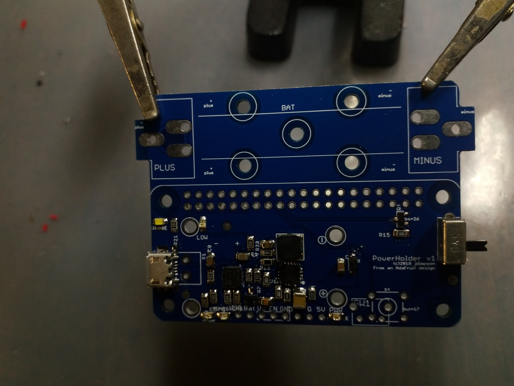

# PowerHolder PCB

Another variation of the AdaFruit PowerBoost 1000C (https://www.adafruit.com/product/2465) adapted for Raspberry Pi Zero. This is functionally similar to the PowerBoard (https://github.com/jdimpson/PowerBoard), but this time, with a side car that holds an entire 18650 Lithium Ion cell. As with PowerBoard, adds a  schottkey diode and programmable tactile button and LED and patches the Low Battery (LBO) signal to the Pi via a level shifter.

Also significant, this board lets you choose whether you want to pick-and-place and then reflow your own electronic components, or just go out and buy a PowerBoost 1000C from AdaFruit. You still have to solder on a diode, the battery holder clips, and (if you want them) the signal LED, programmable button, enable switch, and the level shifting mosfet for the LBO signal. But most of the fiddly parts, notably the U1 and U2 controller chips, you can use from the standard AdaFruit product. Just solder the board into place in the matching header holes with the male header pins they provide, or get some female headers too (that option makes clearance problems).

Note: when you solder a Powerboost in place, it's JST socket won't be accessible. Presumably this is okay because the battery sidecar is right there. The drawback is that the sidecar assumes your 18650 cell has exposed electrical contact on each of the opposing ends of the cell cylinder, rather than wires or tabs spot-welded onto the battery then brought out to a JST or similar connector. You could cut off the connector and solder battery wires onto the BAT and GND pins of the header if you want, or to the plus and minus pads of the battery clips.

Other things worthy of note:
- The MicroUSB connector is not the same foot print as AdaFruit uses in their PowerBoost, because I couldn't figure out which part which part number it was. My chosen replacement still has the through-hole-ish studs for physical reinforcement like Adafruit uses, but the footprints are incompatible.
- A BOM export is provided, which contains Digi-Key part numbers as wellas vendor part numbers.
- Python software that works with the LBO signal, button, and LED are available in the [RPiIoT](https://github.com/jdimpson/RPiIoT) repo. You don't have to use this software to benefit from this board, but you do want to monitor GPIO26/Phy37 because when it goes low, the battery voltage has dropped near the point where the charge controller will soon switch off power.
- Auxillary header is provided for USB/5VDC electrical input if you don't want to use MicroUSB.
- Auxillary header is provided for boosted 5VDC electrical output if you want to power something else with this board (in addition to, or instead of, an RPi Zero). NOte this auxillary output is not protected by the schottkey diode. This is analogous to the USB output header that the original PowerBoost 1000C provides, although the sense resistors used to indicate availability of > 500 mA have been removed.
- Unlike most RPi Zero daughter boards (hats, although this does not qualify as a hat because it has no EEPROM and is larger than the starndard board footprint), this board makes more sense to mount _underneath_ the RPi Zero. You'd do this by soldering female headers into the bottom of the RPi Zero, or better yet, the stacking headers like this: https://www.adafruit.com/product/2223. THen put male headers on the PowerHolder, stack the Zero on the PowerHolder, and then put whatever you want on top of the Zero as normal. You can also put the PowerHolder on top of the Zero (with or without stacking header) but the battery placement make the whole thing look weird to me.
- The PowerBoost 1000C can source about 1 Amp of current. This is plenty for an RPi Zero, with enough to spare for a camera and another hat of some type. It might even be enough to power an RPi 1 plus or 2, and it will boot a 3 but you'll likely see warnings abou undercurrent conditions. It won't run a 3+ or a 4 (well, they say the 4 will adjust power usage, but I don't know if it adapts to as low as an amp, and I wouldn't want to waste a 4 in a low power configuration anyways). It also won't run a servo or other motor, because they seem to have such rapid current draw that the RPi Zero will reboot regularly, presumably due to voltage drop.

Changes 
- v1.01: Changed MicroUSB connector to one I can find on Digikey; move battery terminals further from RPi header; used thinner/narrower battery holder; add more plus and minus signs (near battery and the USB input header); improve location of component names; added circles around all used pins (squares around GND). 

TODO 
- Since the battery is now onboard, Figure out how to use NTC resistor ("THERM" in the schematic) to monitor battery temperature. This board provides a header to place the NTC, although I haven't experimented with it so have no recommendation for part to use.

Raspberry Pi Pins used:

- GPIO17/Phy11 is connected to a momentary / tactile switch. Available for arbitrary software control (typically running my powerboard.py and associated code from the [RPiIoT](https://github.com/jdimpson/RPiIoT) repo).
- GPIO27/Phy13 is connected to a resistor and then an LED. Available for arbitrary software control (e.g. flashing to show grace period, and typically running my powerboard.py and associated code from the [RPiIoT](https://github.com/jdimpson/RPiIoT) repo).
- GPIO26/Phy37 is connected to via transistor and appropriate hold up resistor to the LBO signal of the PowerBoost circuit. This is how the Raspberry Pi knows to shut down. The signal is held at battery level (but level shifted to 3.3 V before hitting the RPi) until the Li Ion battery level drops below 3.4VDC (or maybe it's 3.2V, I forget) at which point the LBO signal drops to ground. This tells the software on the RPi to do a graceful shutdown.

